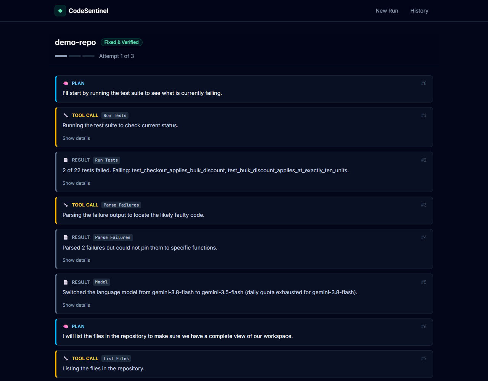
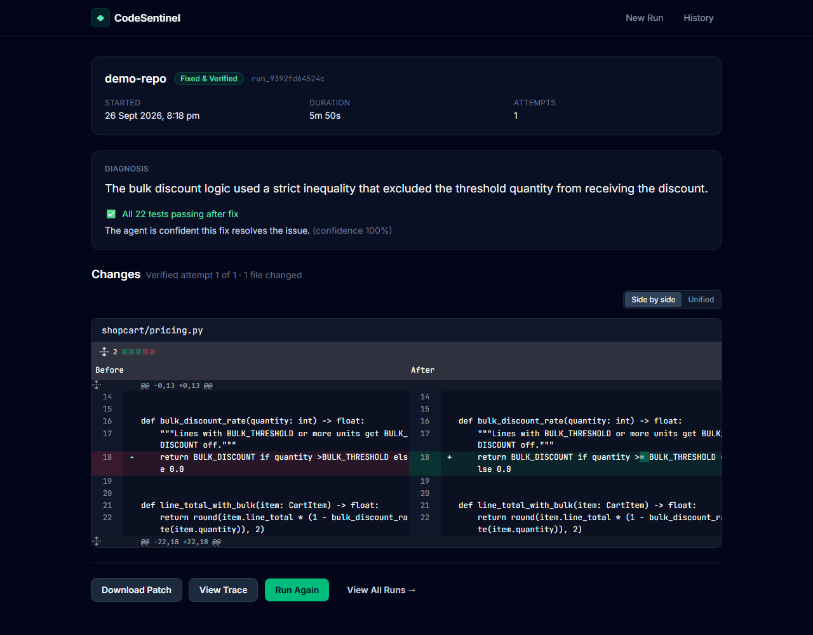
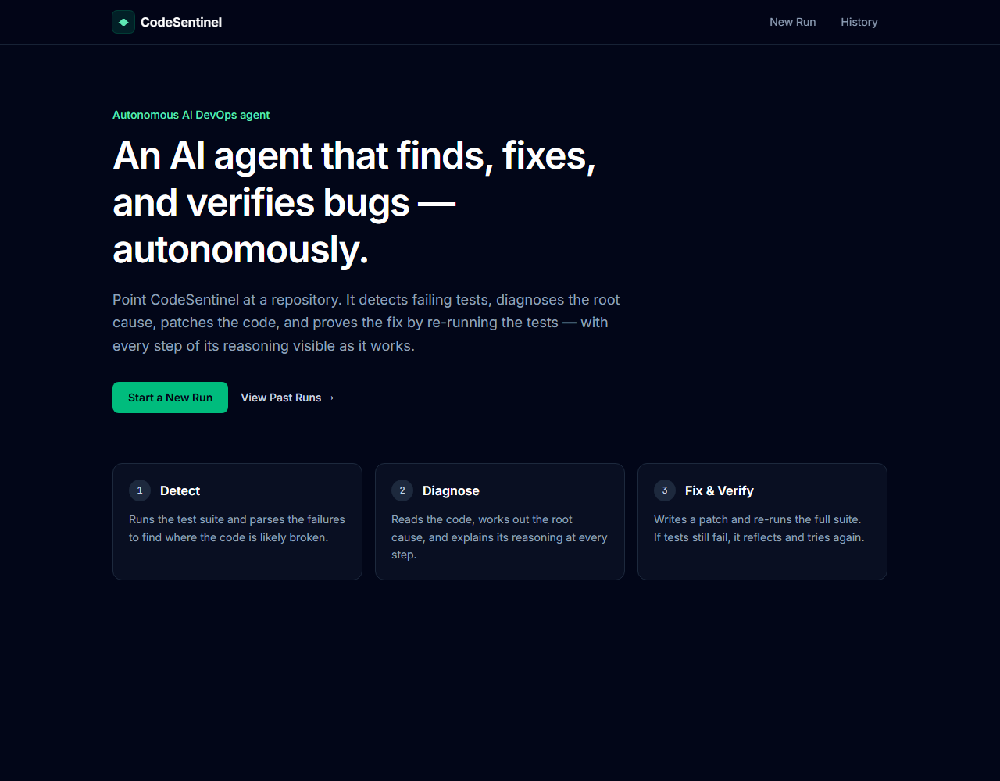
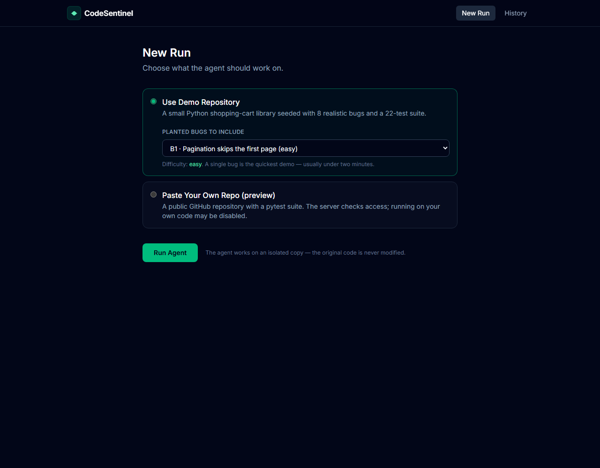
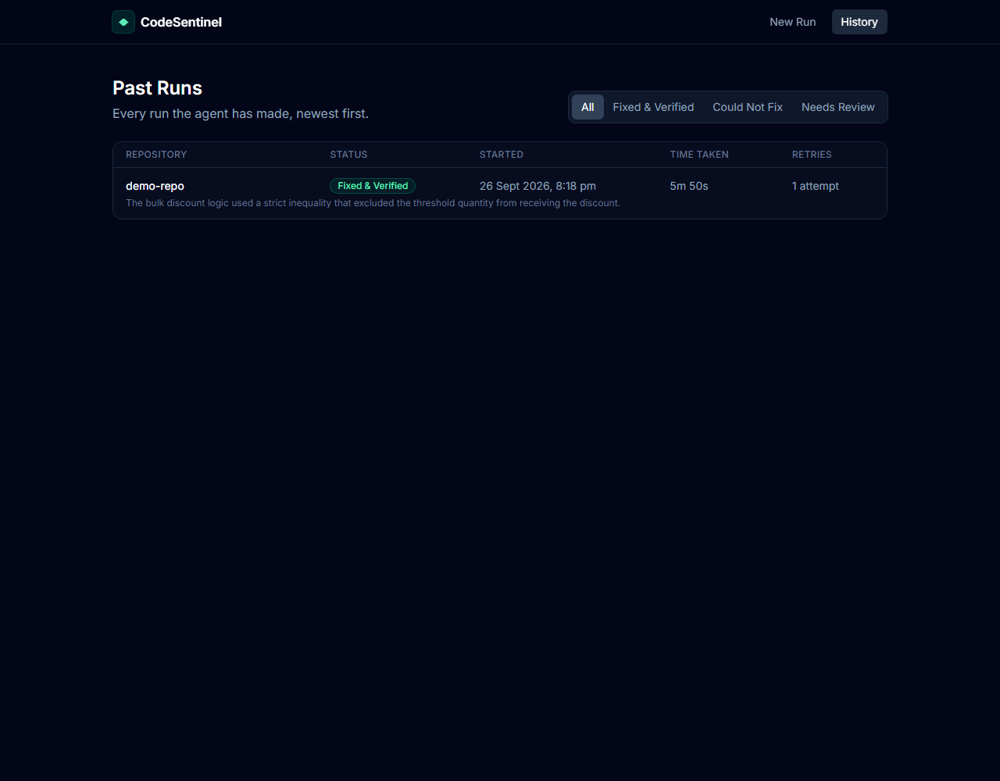
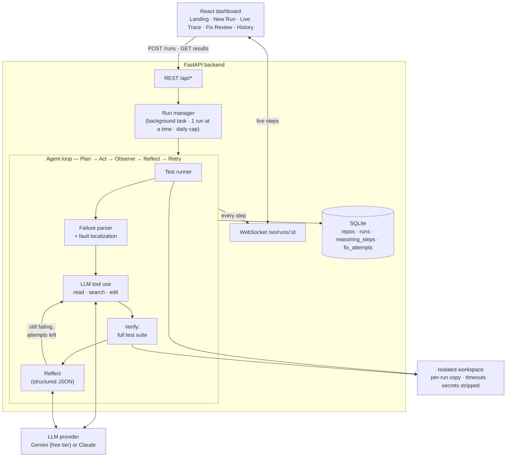

<div align="center">

# ◆ CodeSentinel

**An autonomous AI agent that finds failing tests, diagnoses the root cause, patches the code, and verifies its own fix — with every step of its reasoning streamed live.**

[](https://github.com/NinadPandith/Autonomous-AI-DevOps-Agent/actions/workflows/ci.yml)


[](LICENSE)

[Demo](#demo) · [How it works](#how-it-works) · [Setup](#setup) · [Results](#results) · [Roadmap](#roadmap)

</div>

---

## Demo

**Live Trace** — the agent narrates each plan, tool call, result, and reflection as it works:



**Fix Review** — the plain-language diagnosis, the verified test result, and the exact diff:



<details>
<summary>More screenshots</summary>

| Landing | New Run | History |
|---|---|---|
|  |  |  |

</details>

## Why

Most AI coding tools need a human prompt for every step: check the logs, find the bug, explain it, fix it. CodeSentinel is an **agent** that runs that loop on its own. It detects failing tests, localizes the fault, writes a patch, and uses **self-verification** — re-running the full test suite — with **retry logic** to correct itself when a fix doesn't hold. Every decision is shown with a human-readable reason, so the fix can be trusted rather than treated as a black box.

## Features

- 🔁 **Custom agent loop** — Plan → Act → Observe → Reflect → Retry, written from scratch (no agent framework), using native LLM tool calling.
- ✅ **Self-verification is enforced by code** — the controller, not the model, re-runs the tests after every attempt. Attempts that make things worse are rolled back automatically.
- 🎯 **Fault localization** — traceback analysis plus spectrum-based scoring (the share of a function's calling tests that fail) points the agent at likely culprits.
- 📡 **Live reasoning trace** — every step streams over a WebSocket; refreshing mid-run replays history and falls back to polling if the socket drops.
- 🧾 **Reviewable output** — plain-language diagnosis, confidence, side-by-side diff, and a downloadable `.patch`.
- 🧪 **Seeded benchmark + evaluation harness** — 8 planted bugs from easy to hard, per-bug metrics, and a single-shot baseline for comparison.
- 🔌 **Provider-agnostic** — Google Gemini free tier by default (with automatic model fallback on quota limits) or the Claude API.
- 🛡️ **Guardrails** — per-run isolated workspace, read-only tests, secret-scrubbed subprocesses, time limits, one run at a time, and a daily run cap for public deployments.

## How it works



One run, step by step:

1. **Observe** — run the test suite in an isolated copy of the repository and parse the pytest output.
2. **Localize** — traceback frames point to the function that raised; plain assertion failures are ranked with spectrum-based scoring.
3. **Plan + Act** — the LLM investigates with `read_file`, `search_code`, and `edit_file`, narrating each step. Test files are read-only: the agent must fix the code, not the tests.
4. **Verify** — the controller re-runs the full suite.
5. **Reflect** — the LLM evaluates the outcome as structured JSON: reflection, diagnosis, confidence, bug type.
6. **Retry** — if tests still fail, the failures and the reflection feed the next attempt (up to 3). A regressing attempt is rolled back first.

## Tech stack

| Layer | Technology |
|---|---|
| Agent | Custom Plan → Act → Observe → Reflect loop, native tool calling, structured-output reflection |
| LLM | Google Gemini (free tier, default) or Claude API, behind one provider interface |
| Backend | Python 3.12+, FastAPI, WebSockets, SQLite |
| Frontend | React 19 (Vite), Tailwind CSS 4, React Router 7, react-diff-viewer-continued |
| Isolation | Per-run workspace copy, subprocess timeouts, secret-scrubbed environment |
| Quality | pytest (agent loop + API against a scripted LLM), oxlint, GitHub Actions CI |
| Hosting | Render (API) + Vercel (dashboard), free tiers — see [DEPLOY.md](DEPLOY.md) |

## Setup

**Requirements:** Python 3.12+, Node 20+, and a free Gemini API key from [aistudio.google.com](https://aistudio.google.com) (no credit card).

```bash
git clone https://github.com/NinadPandith/Autonomous-AI-DevOps-Agent.git
cd Autonomous-AI-DevOps-Agent
```

**Backend**

```bash
cd backend
python -m venv .venv
.venv\Scripts\activate              # macOS/Linux: source .venv/bin/activate
pip install -r requirements.txt
copy .env.example .env              # macOS/Linux: cp .env.example .env — then set GEMINI_API_KEY

python scripts/check_llm.py         # confirms the API key works
python scripts/verify_demo_repo.py  # demo repo fails predictably; bug manifest is correct
python -m pytest                    # agent loop + API tests (no API key needed)
uvicorn app.main:app --port 8010    # API — interactive docs at http://localhost:8010/docs
```

**Frontend** (second terminal)

```bash
cd frontend
npm install
copy .env.example .env              # macOS/Linux: cp .env.example .env
npm run dev                         # http://localhost:5180
```

On Windows you can also double-click `start-backend.cmd` and `start-frontend.cmd`.

**Command-line tools** (from `backend/`)

```bash
python run_agent.py --bugs B1           # watch the agent fix one planted bug in the terminal
python run_agent.py                     # all 8 planted bugs at once
python scripts/watch_run.py             # trigger a run over HTTP and follow its WebSocket
python scripts/evaluate.py --baseline   # per-bug evaluation vs. a single-shot baseline
```

## Usage

1. Open the dashboard and click **Start a New Run**.
2. Choose **Use Demo Repository** and pick a planted bug (B1 is the quickest), or **Paste Your Own Repo** (see below).
3. Click **Run Agent** and watch the Live Trace.
4. When the run finishes, click **View Fix** to see the diagnosis, test result, and diff.
5. **History** lists every run, filterable by outcome.

### Running the agent on your own repository

**Paste Your Own Repo** works with public Python repositories on GitHub that have a pytest suite. The agent shallow-clones the repository, creates a fresh virtualenv, installs `requirements*.txt` and the project itself, then runs the same detect → fix → verify loop.

This executes the repository's install scripts and tests on the machine running CodeSentinel, so it is **off by default**. Enable it on a machine you control by setting `ALLOW_USER_REPOS=true` in `backend/.env`. Keep it off on public deployments — see [SECURITY.md](SECURITY.md).

## The benchmark

[`demo-repo/`](demo-repo/) is a small Python shopping-cart library (~250 lines, 22 tests) seeded with 8 bugs. The ground truth lives in [`backend/eval/bugs.json`](backend/eval/bugs.json), outside anything the agent can read.

| Bug | Difficulty | Type |
|---|---|---|
| B1 Pagination skips the first page | easy | off-by-one |
| B2 `find_coupon` crashes when no code is given | easy | null check |
| B3 Bulk discount not applied at exactly the threshold | easy | wrong operator |
| B4 Coupon percentage converted to a fraction twice | medium | logic across two functions |
| B5 Shipping API error responses not handled | medium | API response handling |
| B6 Free-shipping check uses the pre-discount subtotal | medium | ordering |
| B7 Receipts share lines through a mutable default argument | hard | shared state |
| B8 Failed checkout leaves stock reservations in place | hard | missing rollback |

## Results

> The full per-bug evaluation (`python scripts/evaluate.py --baseline`) is in progress — the free API tier allows roughly one full evaluation per day. Results are written to [`backend/eval/results/`](backend/eval/results/).

Runs so far (Gemini free tier):

| Scenario | Outcome | Attempts | Time |
|---|---|---|---|
| All 8 bugs at once | ✅ Fixed & verified — 11 failing → 0 failing of 22 | 1 | 212 s |
| B1 (easy) | ✅ Fixed & verified | 1 | 88 s |
| B3 (easy) | ✅ Fixed & verified | 1 | 350 s ¹ |
| B7 (hard) | ✅ Fixed & verified (single-shot baseline also fixed it) | 1 | 86 s |

¹ The free-tier model was overloaded; the provider fell back to another model twice.

## Project structure

```
├── backend/
│   ├── app/                 FastAPI app: REST routes, WebSocket, run manager, event hub
│   ├── codesentinel/        The agent
│   │   ├── agent.py         Plan → Act → Observe → Reflect → Retry controller
│   │   ├── llm/             Provider interface + Gemini and Claude adapters
│   │   ├── tools/           Test runner, failure parser, code reader, patcher
│   │   ├── repo_setup.py    Clone + isolated install for user repositories
│   │   └── db.py            SQLite schema and queries
│   ├── eval/                Bug manifest (ground truth) and evaluation results
│   ├── scripts/             Setup checks, evaluation harness, live-run watcher
│   ├── tests/               Agent loop + API tests (scripted LLM)
│   └── run_agent.py         Command-line runner
├── frontend/                React dashboard (5 pages, shared components)
├── demo-repo/               Seeded benchmark repository with 8 planted bugs
├── docs/                    Product docs (PRD, app flow, schema, …) and screenshots
├── render.yaml              Render blueprint (API)
└── DEPLOY.md                Free deployment guide (Render + Vercel)
```

## Known limitations

- **Repository layouts:** user repositories are installed and tested from the repository root. Projects whose Python code and tests live in a subfolder (e.g. `backend/`) currently fail to import during test collection; subfolder detection is next on the roadmap.
- **Python + pytest only.**
- **Process-level isolation**, not a container sandbox — see [SECURITY.md](SECURITY.md).
- **Free-tier LLM quotas** (about 20 requests per model per day) limit how many runs fit in a day and can slow runs when a model is overloaded.

## Roadmap

- [ ] Detect projects in subfolders (`backend/`, `src/`) and report setup problems separately from code bugs
- [ ] Harder benchmark bugs where the first attempt is expected to fail, plus full evaluation results
- [ ] Replay mode for the public demo (recorded real runs, no quota needed)
- [ ] Docker sandbox for test execution
- [ ] Long-term memory of past fixes (vector store)
- [ ] Open a GitHub pull request with the verified fix
- [ ] PostgreSQL for durable hosted history

## Documentation

The product was planned before it was built — the planning documents are in [`docs/`](docs/):
[PRD](docs/AI_DevOps_Agent_PRD.md) · [App Flow](docs/AI_DevOps_Agent_AppFlow.md) · [Backend Schema](docs/AI_DevOps_Agent_BackendSchema.md) · [Tech Stack](docs/AI_DevOps_Agent_TechStack.md) · [Implementation Plan](docs/AI_DevOps_Agent_ImplementationPlan.md) · [Content Guidelines](docs/AI_DevOps_Agent_ContentGuidelines.md)

## Contributing

Contributions are welcome — see [CONTRIBUTING.md](CONTRIBUTING.md).

## License

[MIT](LICENSE) © 2026 [Ninad Pandith](https://github.com/NinadPandith)
